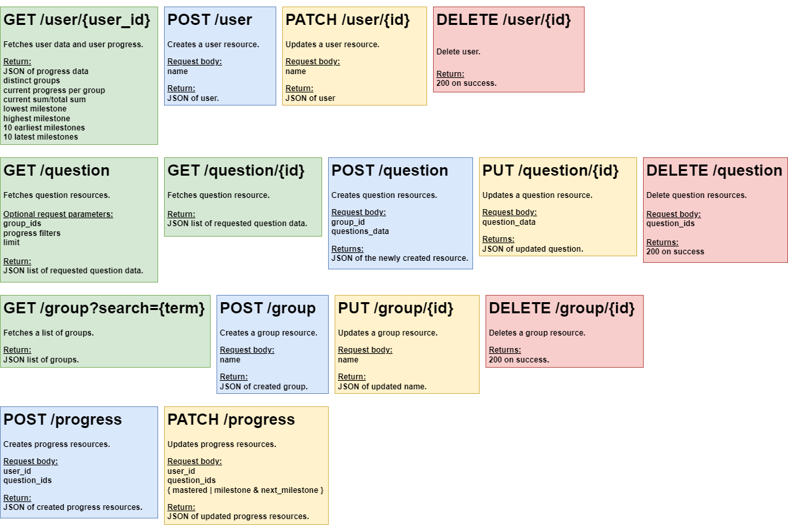

# Learning App

A tool to improve the rate of learning.

# Future Improvements

- Simpler request validations
- Simpler API endpoints
- Frontend app

# ER Diagram


# Database Schema


# API



# Set Up

Create a virtual environment

    `python -m venv venv`

Start up virtual environment

    `source venv/Scripts/activate` on Windows
    `source venv/bin/activate` on Unix

Install dependencies

    `pip install -r requirements.txt`

Update dependencies

    `pip freeze > requirements.txt`

Configure environment in .env file

    ```
    FLASK_APP=learning_app.py
    FLASK_ENV=development
    FLASK_DEBUG=1

    SECRET=dev
    DATABASE_URL=postgresql://postgres@localhost:5432/learning_app
    ```

Running the app

    `flask run`